# WEB SOLUTION WITH WORDPRESS
 
 In this project, you are to launch two AWS instances with one serving as web server and the other as the database server. 

 Three volumes will  be separately attahced to each of the server on the same available zone (AZ). Follow the steps below:

STEP 1 CONFIGURING WEB SERVER

1 *Create an EC2 instance*

create an account on AWS and create an EC2 instance 
[here](https://console.aws.amazon.com/ec2/v2/home) and select Redhat as your AMI.

2 *Adding volumes to web server*
 
 To create a volume, click on volume on your EC2 dashboard and click on "create volume"

 NOTE: Ensure you choose corresponding available zone with the instance you created.

 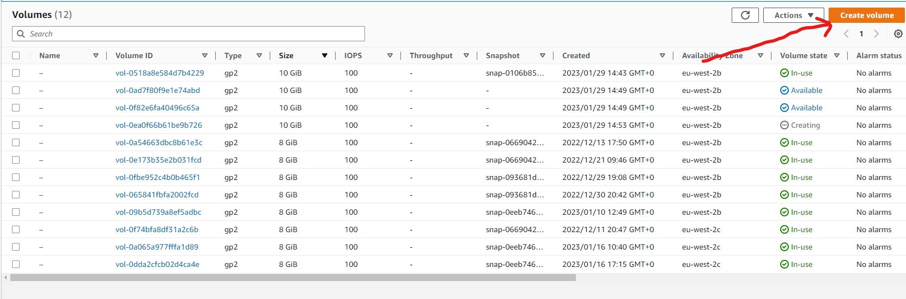

 Then, attach 3 volume each to the instance created one after the other. Click on action and select "attach volume"

 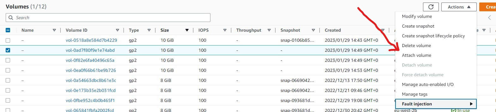

 Select the right instance you want to attach the volume to and click attach.

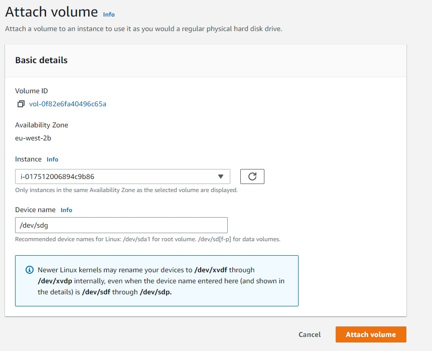

3 *Web server configuration*

Open your linux terminal and connect to your instance. Switch to the root user with command `sudo -i`

Run command `lsblk` to list out all available block devices attached to the instance. Note that all devices in linux are located in /dev/ directory

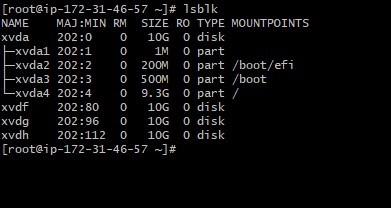

You can check all mounts and available free spaces on your server with `df -h` command.

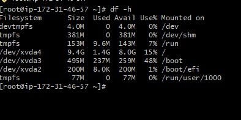

Create a single partition on each of the 3 disks available on the server

`gdisk /dev/xvdf` 

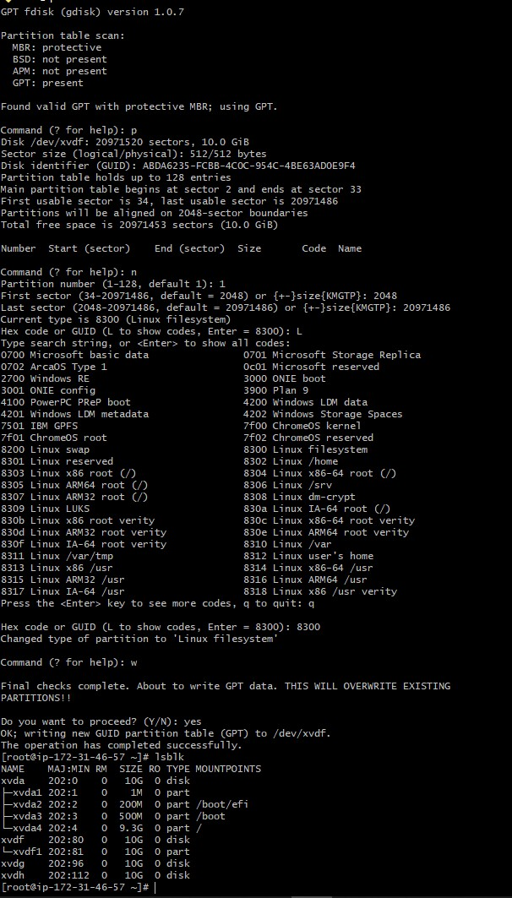

Note: you have to do the same thing with  disks xvdg and xvdh.

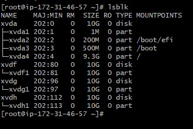

4 *configure logical volume*

Install Logical volume management package to scan the available partitions on your server

`yum install lvm2 -y`

`lvmdiskscan`

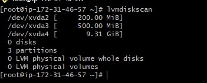

For your disks to be used as physical volume by LVM, create PVs

`pvcreate /dev/xvdf1`

`pvcreate /dev/xvdg1`

`pvcreate /dev/xvdh1`

You can verify if the PVs you created is created succesffully with command 
`pvs`

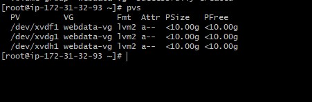

Add the three physical volumes created to the same volume group (VG). Name the VG "webdata-vg" 

`vgcreate webdata-vg /dev/xvdh1 /dev/xvdg1 /dev/xvdf1`

then, check if the VG is being created successfully with command `vgs`

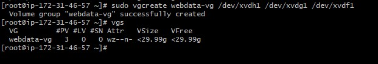

Create 2 logical volumes and name them apps-lv and logs-lv respectively. apps-lv will utilize half of the pv size while logs-lv will used the remaining half. The data for the website will be stored in the apps-lv while the logs-lv will be used to store data for logs.

To create the apps-lv and logs-lv  run command:

`lvcreate -n apps-lv -L 14G webdata-vg`

`lvcreate -n logs-lv -L 14G webdata-vg`

use `lvs` command to confirm that the two LVs have been created successfully.

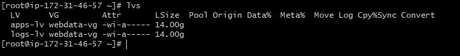

If you wish to verify the entire setup run command

`vgdisplay -v #view complete setup - VG, PV, and LV`

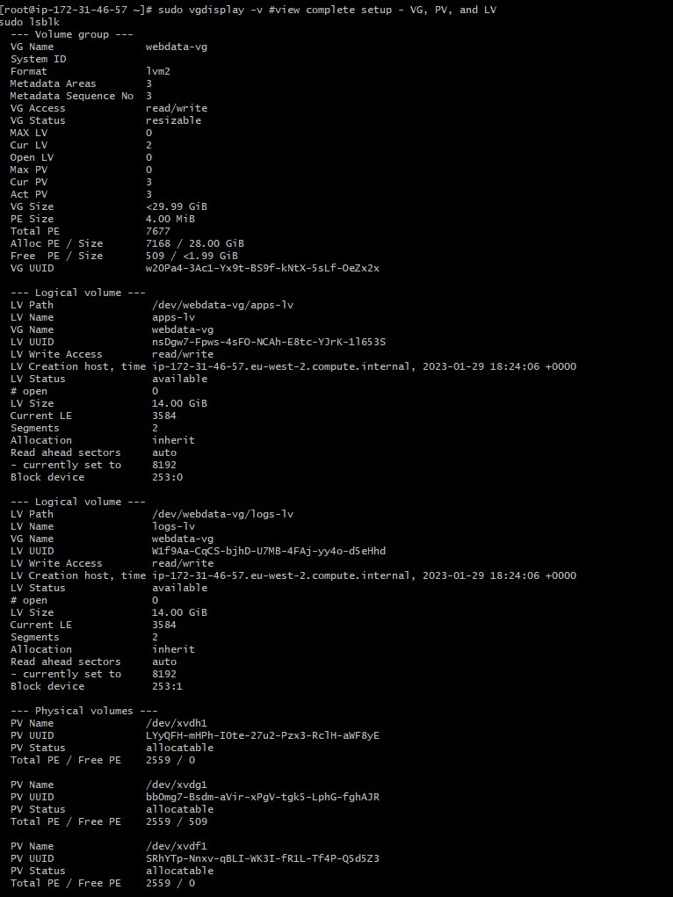

you can as well run `lsblk` command to check the new status of the blocks

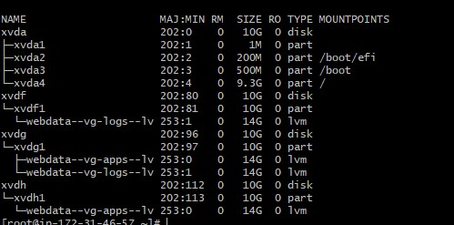

Format the logical volume with ext4 filesystem

`mkfs -t ext4 /dev/webdata-vg/apps-lv`

`mkfs -t ext4 /dev/webdata-vg/logs-lv`

create /var/www/html directory in which the wordpress data will be stored. 

`mkdir -p /var/www/html`

Also, create /home/var/logs directory to store log data backup.

`mkdir -p /home/recovery/logs`

Mount /var/wwww/html on apps-lv logical volume

`mount /dev/webdata/-vg/apps-lv /var/www/html/`

Backup all the files in the log directory /var/log into /home/recovery/logs becuase mounting the filesystem will delete all existing data in the directory.

`rsync -av /var/log/. /home/recovery/logs/`

Afte the data in the /var/log directory have been backed up, mount /var/log on logs-lv logical volume

`mount /dev/webdata-vg/logs-lv /var/log`

Restore files in the /var/log directory back with 

`rsync -av /home/recovery/logs/. /var/log`

Configure /etc/fstab file with your own Universal User Identity (UUID). To get your own UUID run command  `blkid`

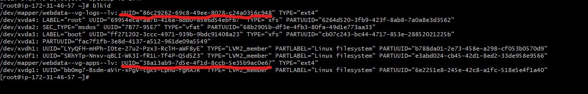

copy the UUID you got from `blkid` command as underlined in the image above and the open the /etc/fstab file with any text editor of your choice

`vi /etc/fstab` and the paste in the UUID as shown in the example below

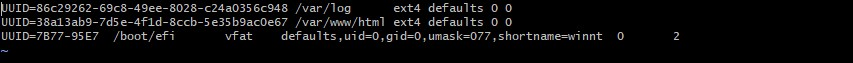

Test the configuration and reload the daemon

 `mount -a`

 `systemctl daemon-reload`

 If you wish, you can verify you setup with command `df -h`

 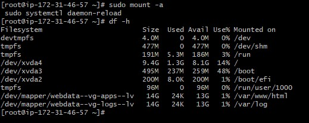

 STEP 2 PREPARING DATABASE SERVER

Has specified in the step 1, open another terminal and launch the database server. Follow all the instructions giving for configuring the web server but change the directory /var/www/html to "db" and apps-lv to "db-lv".

STEP 3 INSTALL WORDPRESS ON WEB SERVER EC2

*Update the server* 
 
 `yum update -y`

 *Install wget, Apache and it's dependencies*

 `yum -y install wget httpd php php-mysqlnd php-fpm php-json`

 *Start Apache*

`systemctl enable httpd`
`systemctl start httpd`

*Install PhP and its dependencies*
`yum install https://dl.fedoraproject.org/pub/epel/epel-release-latest-8.noarch.rpm`

`yum install yum-utils http://rpms.remirepo.net/enterprise/remi-release-8.rpm`

`yum module list php`

`yum module reset php`

`yum module enable php:remi-7.4`

`yum install php php-opcache php-gd php-curl php-mysqlnd`

`systemctl start php-fpm`

`systemctl enable php-fpm`

`setsebool -P httpd_execmem 1`

Restart Apache

`systemctl restart httpd`

*Download wordpress to /var/www/html*

create a new directory called wordpress and open it.

`mkdir wordpress`

`cd wordpress`

then download wordpress data from wordpress website with command

`wget http://wordpress.org/latest.tar.gz`

`tar xzvf latest.tar.gz`

`rm -rf latest.tar.gz`

Copy the wordpress configuration and pass it to /var/www/html

`cp wordpress/wp-config-sample.php wordpress/wp-config.php`

`cp -R wordpress /var/www/html/`

configure apache to make use of wordpress data in the /var/www/html

`chown -R apache:apache /var/www/html/wordpress`

`chcon -t httpd_sys_rw_content_t /var/www/html/wordpress -R`

`setsebool -P httpd_can_network_connect=1`

STEP 4 CONFIGURE DATABASE SERVER FOR WORDPRESS

update the server and install mysql

`yum -y update`

`yum install mysql-server`

start mysql and check the status to know if it is up and running

`systemctl start mysqld`

`systemctl status mysqld`

Login to mysql console

`mysql`

create wordpress as a database user

`CREATE DATABASE wordpress;`

`CREATE USER `<name of user>`@`<Web-Server-Private-IP-Address>` IDENTIFIED BY 'mypass';`

`GRANT ALL ON wordpress.* TO 'myuser'@'<Web-Server-Private-IP-Address>';`

`FLUSH PRIVILEGES;`

`SHOW DATABASES;`

`exit`

STEP 6 CONFIGURE WORDPRESS TO CONNECT REMOTELY TO DATABASE

You need to first open your DB EC2 security group and open port 3306 and allow access to the server only from the web server private ip address. 

On your web server, install mysql

`yum install mysql`
 
 open the mysql console on the web server  and verify if you can execute `SHOW DATABASES;` command to see existing databases

 `mysql -u <name of user> -p -h <DB-Server-Private-IP-Address>`

 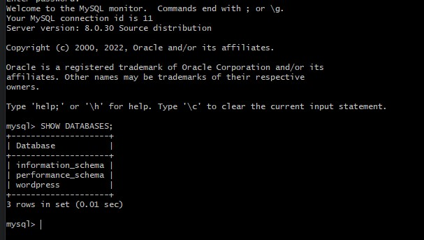

Then, Enable TCP port 80 in inbound Rules configuration for your Web Server EC2

From your web browser, try to access the link to your wordpress

`http://<web-server-public-ip-Address>/wordpress`

If your configuration is correct then you should see the following output

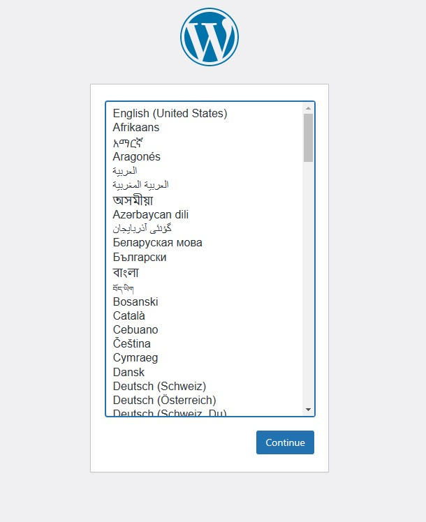

Select language and hit continue botton

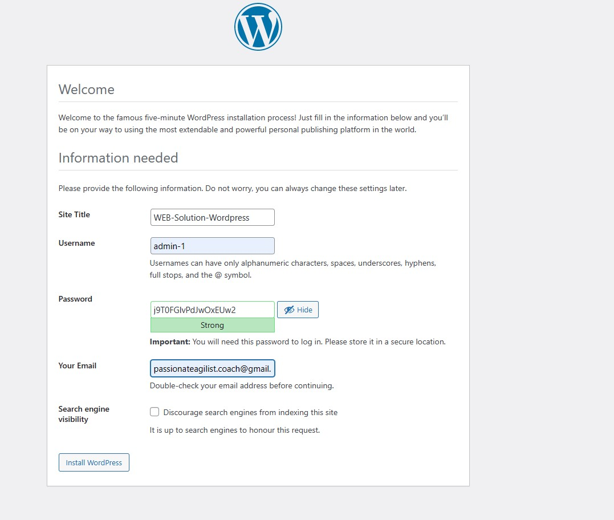

Write title, username and select password of choice, and your email address. Then, hit install wordpress botton.

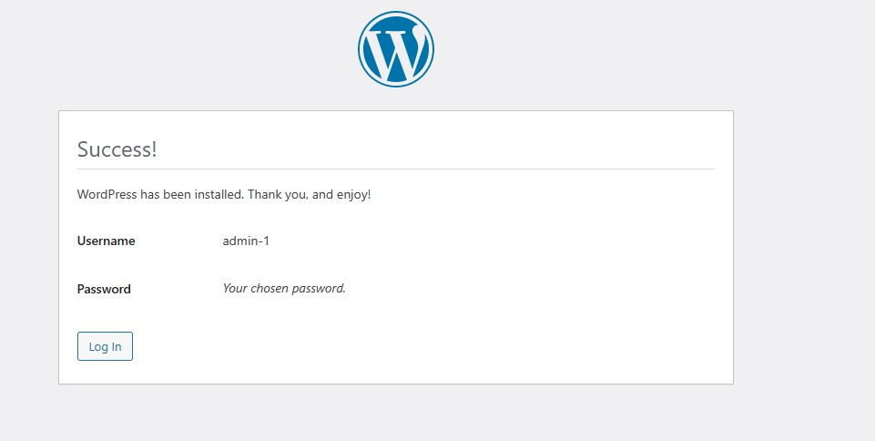

log in again

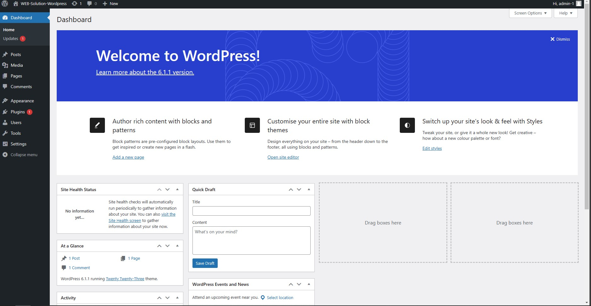

HURRAY!!! and Congratulations if you are able to see the page above. 